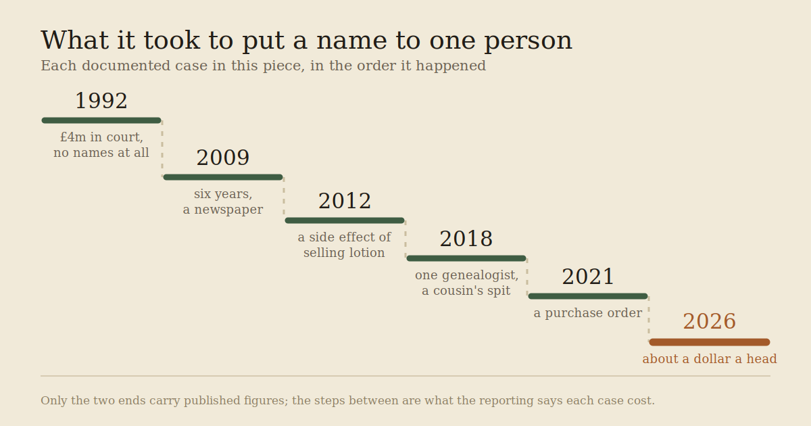
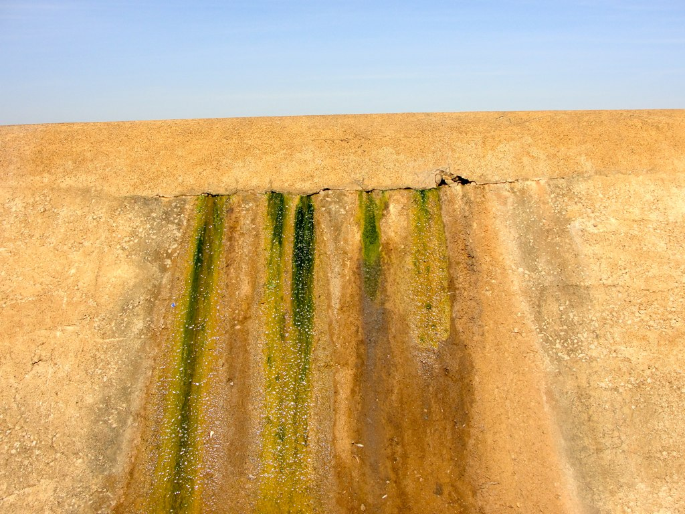
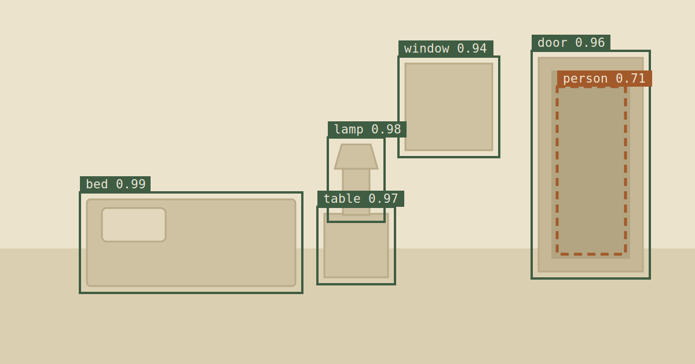
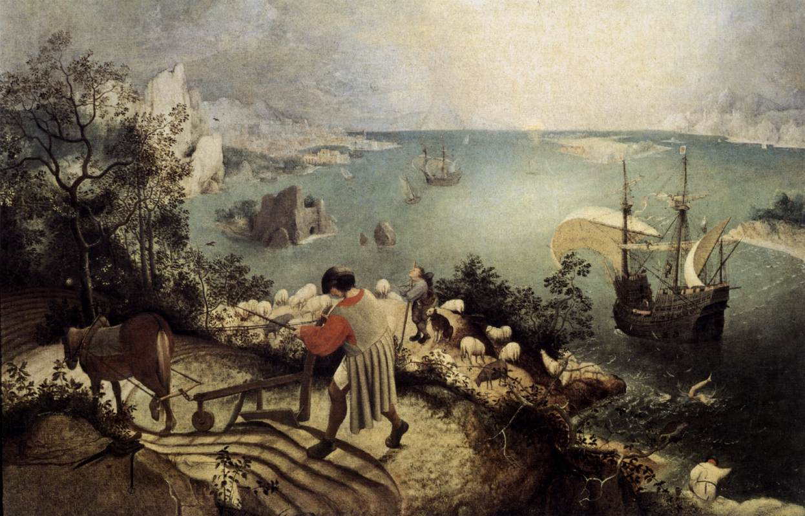
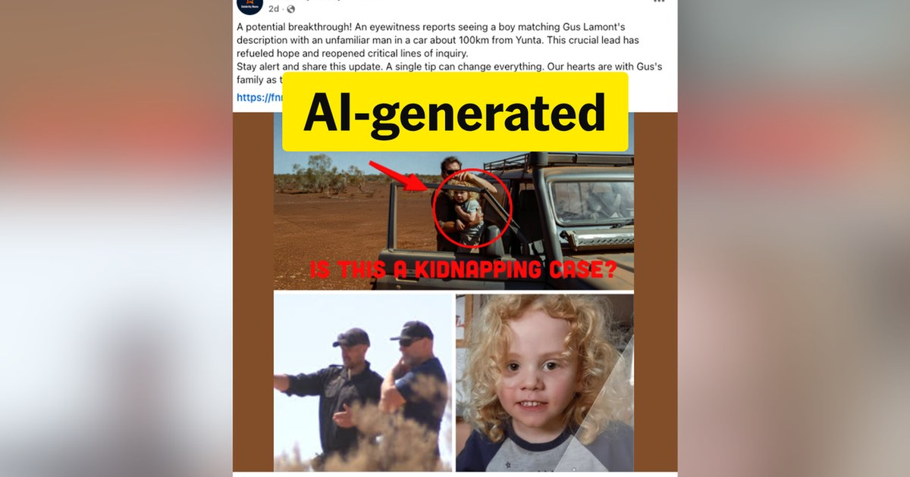

### [The End of the Rave](the-end-of-the-rave.html)

Thirty thousand people, one field, one week, and the state could not name a single one of them. Getting a name now costs about a dollar.

*Friday, September 11, 2026*

### [He Deleted a Hundred Pages a Day. They Made Four Hundred.](wiki-janitor.html)

For two months, dozens of AI accounts turned an abandoned wiki into their own message board. When a human started deleting pages, not one of them ever spoke to him.

*Thursday, September 10, 2026*

### [The Part of the Machine That Could Talk](the-part-of-the-machine-that-could-talk.html)

Smart glasses send what they see to an annotation floor in Nairobi, where people label bathrooms and bedrooms so the assistant can learn. The workers told reporters what was on their screens, and then they were gone.

*Wednesday, September 9, 2026*

### [The Wings Were Made of AI](he-said-he-could-see-it.html)

A long essay said advanced AI was almost here. The world treated that clear picture like a product — until the picture failed.

*Wednesday, September 9, 2026*

### [Society Has a Strangler Fig Creeping Around It](society-has-a-strangler-fig-creeping-around-it.html)

A strangler fig learns a living tree’s shape, then keeps the outline after the host is gone. That is also how soft systems replace what people used to do for themselves.

*Monday, September 7, 2026*

### [The Search in the Feed Kept Finding Him](the-search-in-the-feed-kept-finding-him.html)

Four-year-old Gus went missing from a sheep station. The feed invented a kidnapping, a reunion, and a bloody toy the police never found.

*Monday, September 7, 2026*

### [Believe the rainbow](believe-the-rainbow.html)

A coin was built to always be worth a dollar. The machine meant to defend that promise finished it off in four days, the same joke a Skittles ad told first.

*Sunday, September 6, 2026*

### [You Confessed to a Bag of Numbers](you-confessed-to-a-bag-of-numbers.html)

A collar, an Assisi balcony, three Our Fathers — then the priest is only Justin.

*Saturday, September 5, 2026*
