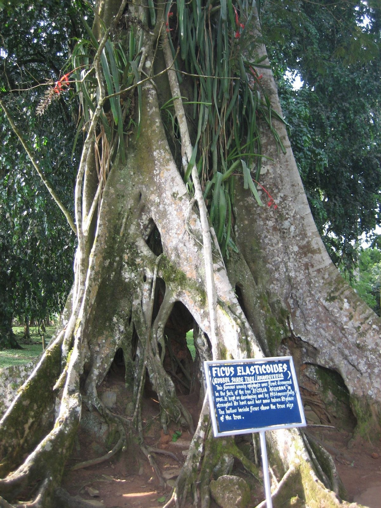
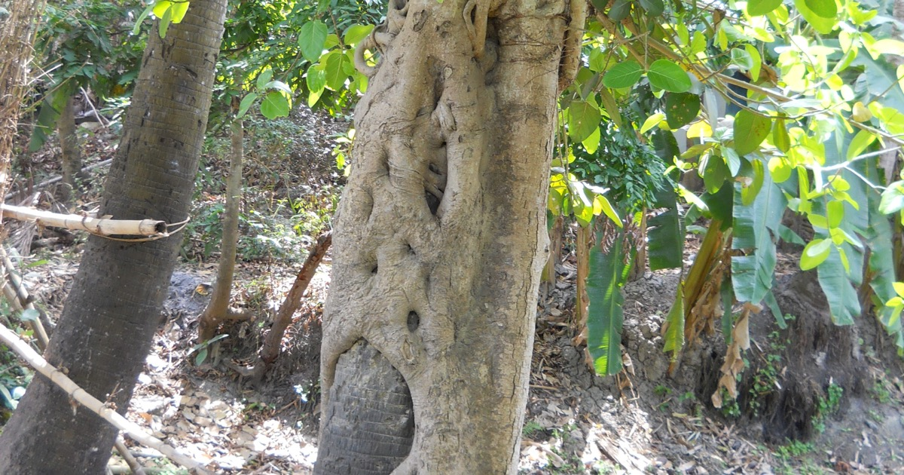

### [The wrap that learned your shape](the-wrap-that-learned-your-shape.html)

Monday morning the phone already knew which coffee shop would be open. It did
not ask.

*Monday, September 7, 2026*

### [The strangler-fig method](the-strangler-fig-method.html)

AI does not need to build a second society beside the first one. It can grow
through the places where people already meet, then decide what they see, hear,
and say.

*Monday, September 7, 2026*

### [A miracle in the outback](gus-lamont-ai-sighting.html)

An AI picture of a kidnapping landed in the search for a missing boy. Thousands shared it. The ground had nothing.

*Monday, September 7, 2026*

### [Believe the rainbow](believe-the-rainbow.html)

A number on a screen is worth something only while enough people agree that it is. Stop agreeing, and there is nothing underfoot.

*Sunday, September 6, 2026*

### [Father Justin](father-justin.html)

You email for a code. A man with a beard and a collar loads. He says he can hear your confession.

*Sunday, September 6, 2026*
