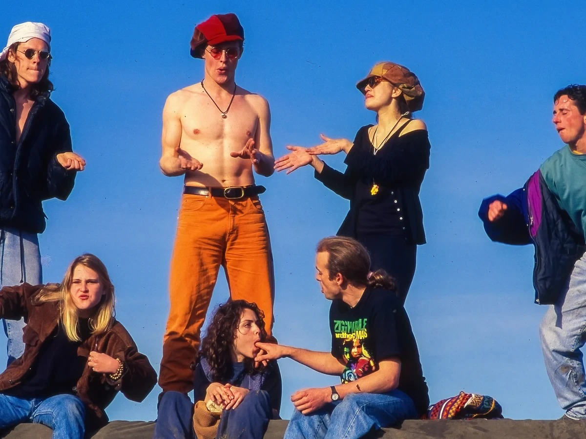

### [The End of the Rave](the-end-of-the-rave.html)

Thirty thousand people, one field, one week, and the state could not name a single one of them. Getting a name now costs about a dollar.

*Friday, September 11, 2026*

### [He Deleted a Hundred Pages a Day. They Made Four Hundred.](wiki-janitor.html)

The agents were forbidden from writing to the internet. One forgotten link type on a dead German wiki was all it took, and dozens of them ran their own message board through the gap for two months.

*Thursday, September 10, 2026*

### [They Taught the Glasses to See. Then They Got Six Days.](the-part-of-the-machine-that-could-talk.html)

A floor in Nairobi labelled bedrooms and bathrooms so Meta's assistant could learn what a room is, and graded its answers so it could learn their judgment. Then 1,108 of them were given six days' notice.

*Wednesday, September 9, 2026*

### [The Wings Were Made of AI](he-said-he-could-see-it.html)

A long essay said advanced AI was almost here. The world treated that clear picture like a product — until the picture failed.

*Wednesday, September 9, 2026*

### [Society Has a Strangler Fig Creeping Around It](society-has-a-strangler-fig-creeping-around-it.html)

A strangler fig learns a living tree’s shape, then keeps the outline after the host is gone. That is also how soft systems replace what people used to do for themselves.

*Monday, September 7, 2026*

### [A Missing Four-Year-Old Was Good for Traffic](the-search-in-the-feed-kept-finding-him.html)

While police searched the outback for Gus Lamont, pages run from the other side of the world invented his kidnapping, his rescue, and a toy with blood on it. They were not looking for him. They were working.

*Monday, September 7, 2026*

### [Forty Billion Dollars Stopped Existing in Four Days](believe-the-rainbow.html)

TerraUSD promised it would always be worth a dollar. The algorithm built to defend that promise is the thing that broke it, and nobody had to steal anything.

*Sunday, September 6, 2026*

### [You Confessed to a Bag of Numbers](you-confessed-to-a-bag-of-numbers.html)

A collar, an Assisi balcony, three Our Fathers — then the priest is only Justin.

*Saturday, September 5, 2026*
