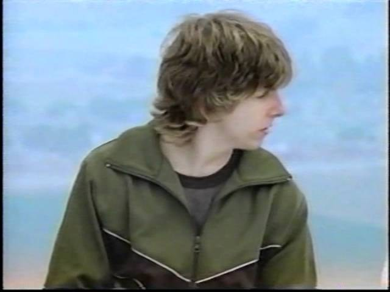

:::card-grid{columns="6"}
:::card{span="full"}
### [A miracle in the outback](articles/gus-lamont-ai-sighting.html)

An AI picture of a kidnapping landed in the search for a missing boy. Thousands shared it. The ground had nothing.

*Monday, September 7, 2026*
:::
:::card{span="3"}
### [Believe the rainbow](articles/believe-the-rainbow.html)

A number on a screen is worth something only while enough people agree that it is. Stop agreeing, and there is nothing underfoot.

*Sunday, September 6, 2026*
:::
:::card{span="3"}
### [Father Justin](articles/father-justin.html)

You email for a code. A man with a beard and a collar loads. He says he can hear your confession.

*Sunday, September 6, 2026*
:::
:::
